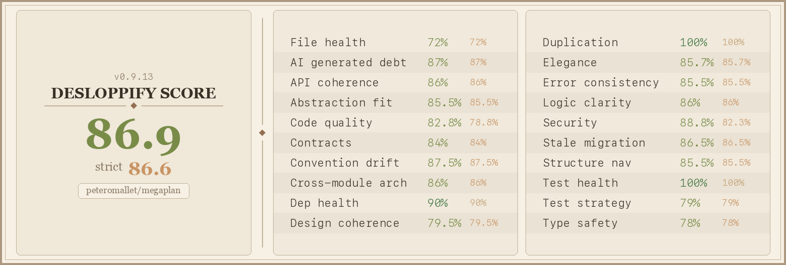

# Megaplan

A planning and execution harness that helps LLMs solve complex tasks through structured phases — prep, plan, critique, gate, execute, and review. Instead of one-shot attempts, Megaplan gives any model a rigorous process with independent critique and gating.

## Quick Start — Claude Code / Codex

Copy and give this to your agent:

```
Please install megaplan and set it up for this project:

pip install megaplan-harness
megaplan setup

Once you're done, ask me what I need megaplan for.
```

## Quick Start — Open Models via OpenRouter

Copy and give this to your agent:

```
Please install megaplan with the open-model backend and set it up:

pip install megaplan-harness hermes-agent

Then create ~/.hermes/.env with:
OPENROUTER_API_KEY=<my key>

Then run: megaplan setup

Once you're done, ask me what I need megaplan for.
```

Get an OpenRouter key at [openrouter.ai/keys](https://openrouter.ai/keys). Any model on OpenRouter works — Qwen, Llama, Mistral, DeepSeek, etc.

---

## How it works

```
prep → plan → critique → gate → [revise → critique → gate]* → finalize → execute → review
```

Each phase can use a different model. The critique phase uses an independent model to review the plan and raise flags. The gate decides whether to proceed or iterate. This prevents models from rubber-stamping their own work.

## Running manually

```bash
megaplan init --project-dir . "Fix the authentication bug in login.py"
megaplan plan --plan <name>
megaplan critique --plan <name>
megaplan gate --plan <name>
megaplan finalize --plan <name>
megaplan execute --plan <name>
```

## Using different models per phase

Models with provider prefixes route to direct APIs. Models without a prefix go through OpenRouter:

```json
{
  "models": {
    "prep": "zhipu:glm-5.1",
    "plan": "zhipu:glm-5.1",
    "critique": "minimax:MiniMax-M2.7-highspeed",
    "execute": "zhipu:glm-5.1",
    "review": "minimax:MiniMax-M2.7-highspeed"
  }
}
```

Configure direct provider keys in `~/.hermes/.env`:

```bash
ZHIPU_API_KEY=...          # for zhipu: prefix
MINIMAX_API_KEY=...        # for minimax: prefix
GEMINI_API_KEY=...         # for google: prefix
```

## Robustness levels

- **light** — no structured critique, fast
- **standard** — 4 critique checks (default)
- **heavy** — 8 critique checks + prep research phase

## SWE-bench Experiment

Megaplan is being tested live against Claude 4.5 Opus on SWE-bench Verified:

- **[Live dashboard](https://peteromallet.github.io/swe-bench-challenge/)** — watch the experiment in real time
- **[hermes-megaplan](https://github.com/peteromallet/hermes-megaplan)** — experiment orchestration code

## Code Health



## License

MIT
